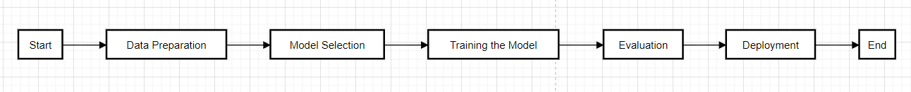

# Review Prediction Using LLM Embedding Model


## Overview

Using embeddings from large language models, we can effectively predict ratings from text reviews by converting reviews into dense vector representations and then training a regression model on these embeddings.

## Features

- Input text through a web interface
- Display the predicted rating on the web page.

## Project-Flow
<div align="center">

</div>

## Technologies Used

- Python
- Flask
- Transformers
- Embedding Models 

## Setup and Installation

### Prerequisites

- Python 3.9+
- pip
- pip install requirements.txt

### Installing Dependencies

1. Clone the repository:

```bash
git clone https://github.com/AY-Anish-Yadav/review_prediction_using_llm_embeddings.git
cd review_prediction_using_llm_embeddings
   python app.py
   ```

## Contributing

Contributions are welcome! If you would like to contribute to the project.

## License

This project is licensed under the Apache 2.0 License - see the LICENSE file for details.

## Contact

For any inquiries or feedback, feel free to contact:

Anish Yadav - reach.anish.yadav@gmail.com

